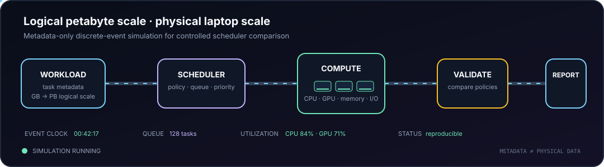

<div align="center">


### Statistical machine learning for reliable inference under heterogeneity, shift, and limited information

[](mailto:malek.ma.itani@gmail.com)
[](https://linkedin.com/in/malek-ma-itani)
[](https://www.google.com/maps/place/Beirut)

</div>

---

## Research identity

I am a statistical machine learning researcher developing methods for reliable prediction and inference when data are heterogeneous, contaminated, acquisition-sensitive, or computationally constrained.

My work combines **robust statistics**, **Bayesian and latent-variable modelling**, **model diagnostics**, and **computational machine learning**. Across biomedical imaging, financial systems, environmental dependence, and scientific computing, I return to the same question:

> **Does a model recover genuine predictive structure, or a stable artefact of how the data were generated and acquired?**

I am completing an MSc in Applied Statistics at Beirut Arab University with a **4.0/4.0 CGPA**.

## Current research

<table>
<tr>
<td width="50%" valign="top">

### [Trapped by Stability](https://github.com/Ma-Mar-Itan/Trapped-by-Stability)

**Acquisition-aware falsification for breast MRI radiomics**

A reproducible analysis of 922 patients and 529 radiomic features asking whether stable phenotypes represent biology or scanner and pulse-sequence artefacts.

`radiomics` `falsification` `measurement bias` `Python`

</td>
<td width="50%" valign="top">

### Hidden Regimes of Financial Instability

**Finite-mixture modelling of systemic banking crises**

Regime discovery across 92 countries from 1970–2019, showing how pooled estimates can conceal distinct macro-financial risk channels.

`finite mixtures` `panel econometrics` `latent regimes` `R`

</td>
</tr>
<tr>
<td width="50%" valign="top">

### The Illusion of Predictability

**Structural heterogeneity in corporate greenwashing**

Tests whether weak prediction reflects model misspecification or a genuine limit in observable public-firm information, using recursive partitioning and repeated out-of-sample validation.

`model-based partitioning` `validation` `model risk` `R`

</td>
<td width="50%" valign="top">

### [Scientific Workflow Simulation](https://github.com/Ma-Mar-Itan/Metadata-Driven-Simulation-of-Petabyte-Scale-Scientific-Workflows-on-Commodity-Hardware)

**Logical petabyte-scale workloads on commodity hardware**

A metadata-driven discrete-event framework for controlled comparison of scheduling policies under workload uncertainty and resource constraints.

`simulation` `scheduling` `HPC` `Python`

</td>
</tr>
</table>

<div align="center">

</div>

## Research software

| Project | What it does | Live use |
|---|---|---|
| **[NatureDepPrint](https://github.com/Ma-Mar-Itan/NatureDepPrint)** | Explores fixed-scale nature-dependence fingerprints across 222,564 firm-year records, 26,195 companies, and 21 ecosystem services. | Repository |
| **[Equity Portfolio Risk Engine](https://github.com/Ma-Mar-Itan/Equity-Portfolio-Risk-Management-Engine)** | End-to-end portfolio risk modelling with VaR, Expected Shortfall, volatility modelling, and backtesting. | Repository |
| **[PanelScope](https://github.com/Ma-Mar-Itan/PanelScope)** | Finds coverage-consistent variable sets for panel data under an explicit sample-retention constraint. | [Launch app](https://panelscope-ktfjvxg6bdkgeeb6rhdtly.streamlit.app) |
| **[BibBrief](https://github.com/Ma-Mar-Itan/BibBrief)** | Converts large BibTeX libraries into structured Word documents for literature screening. | [Launch app](https://bibbrief-rexvitzkduhce2j9zitkgv.streamlit.app/) |
| **[Principia Statistica](https://github.com/Ma-Mar-Itan/principia-statistica-web)** | A book-in-progress on the intuitive foundations of mathematical evidence, inference, and risk. | Repository |

## Methodological toolkit

```text
Inference & modelling     regression · finite mixtures · latent variables · Bayesian methods
Reliability              falsification · stability · sensitivity · specification testing
Validation               bootstrap · out-of-sample evaluation · backtesting · diagnostics
Structured data          panel methods · survival analysis · time series · missing data
Scientific computing     simulation · reproducible pipelines · numerical evaluation
```

**Languages and tools:** Python · R · SQL · Git · LaTeX · NumPy · pandas · SciPy · statsmodels · scikit-learn · Keras · tidyverse · plm · forecast

## Selected experience

- **Quantitative Research Intern, QFI** — leading development of an equity portfolio risk engine and coordinating a ten-person team.
- **Researcher, Lebanese American University** — latent heterogeneity, systemic banking crises, corporate prediction, and firm-level nature dependence.
- **Research Statistician, Center of Applied Statistics** — statistical design and analysis across more than 40 interdisciplinary projects.
- **Data Scientist, metaSOFT** — multimodal medical AI, clinical modelling pipelines, and foundation-model reliability evaluation.
- Earlier training across **medicine, chemistry, medical statistics, biosensing, biomaterials, and scientific computing**.

## Publications and manuscripts

- **Trapped by Stability:** A Falsification Framework for Acquisition-Driven Radiomic Phenotypes — manuscript in preparation, 2026.
- **The Illusion of Predictability:** Structural Heterogeneity and Informational Noise in Corporate Greenwashing — under review, 2026.
- **Hidden Regimes of Financial Instability:** A Finite Mixture Modelling Approach to Systemic Banking Crises — under review, 2026.
- **Gold Nanoparticles-Coated Polystyrene Beads for the Multiplex Detection of Viral DNA** — *Sensors and Actuators B: Chemical*, 2017.

---

<div align="center">

### Reliable models begin with harder questions about the data-generating process.

[Email](mailto:malek.ma.itani@gmail.com) · [LinkedIn](https://linkedin.com/in/malek-ma-itani) · [Repositories](https://github.com/Ma-Mar-Itan?tab=repositories)

</div>
